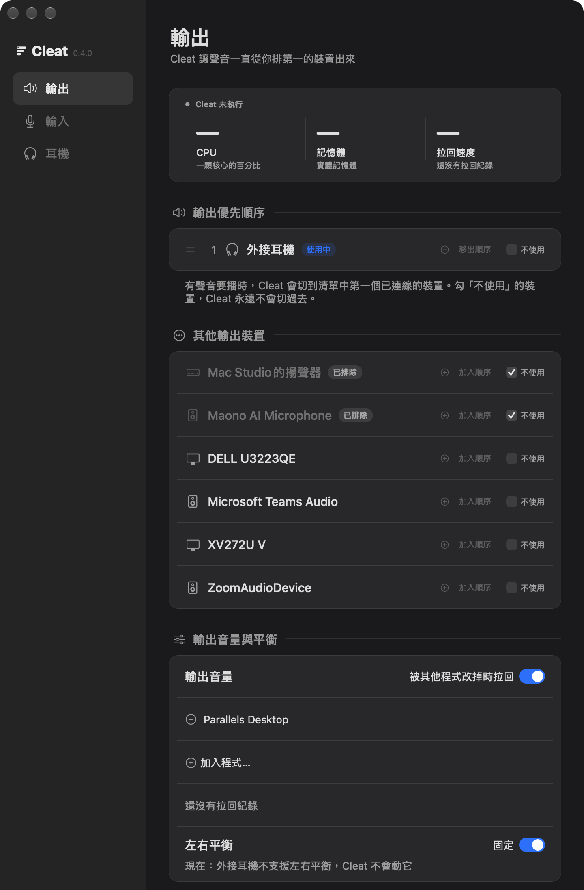
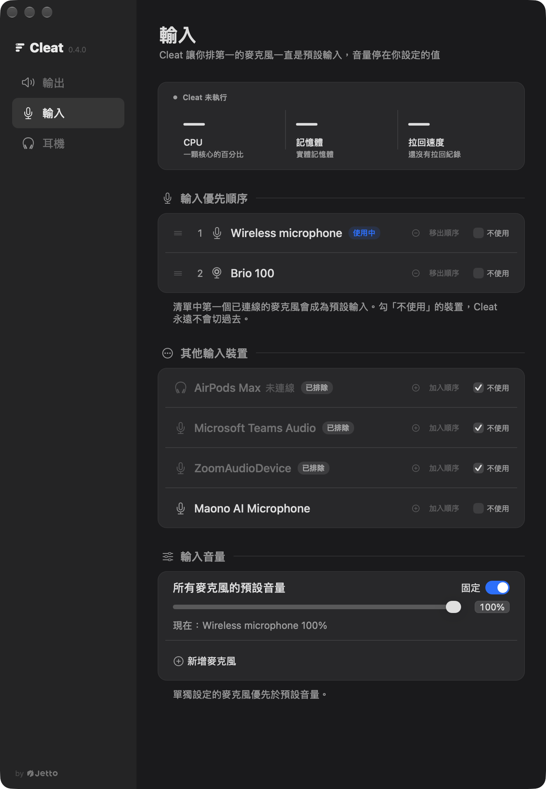
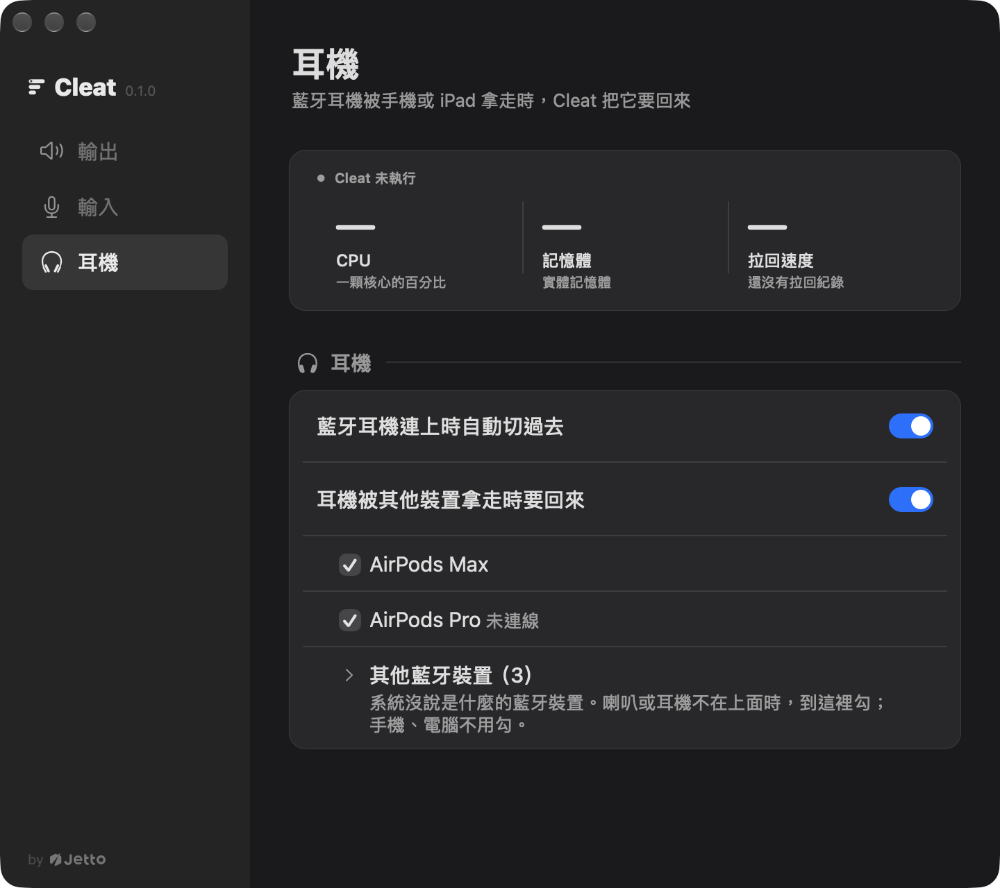
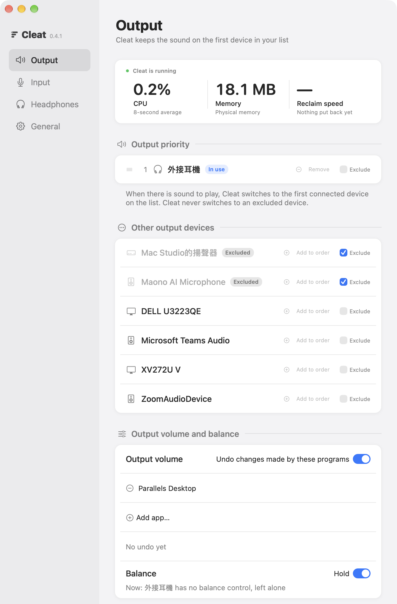

<h1 align="center">Cleat</h1>
<p align="center"><sub>by <a href="https://jetto.ai">Jetto</a></sub></p>

<p align="center">Mac의 오디오 장치를 당신이 정한 자리에 붙잡아 둡니다.<br>맞는 스피커로 소리를 내고, 맞는 마이크를 맞는 음량으로 유지하고, AirPods를 휴대폰에서 되찾아 옵니다.</p>

<p align="center"><a href="README.md">English</a> · <a href="README.zh-TW.md">繁體中文</a> · <a href="README.zh-CN.md">简体中文</a> · <a href="README.ja.md">日本語</a> · <b>한국어</b></p>

클리트(cleat)는 배가 떠내려가지 않도록 밧줄을 묶어 두는 고정쇠입니다. 이 Cleat는 오디오 장치용입니다. 어떤 출력, 어떤 마이크, 어떤 음량, 어떤 밸런스를 원하는지 알려 주면 Cleat가 그대로 유지합니다. 폴링하지 않고 CoreAudio 이벤트에 반응하므로 CPU를 거의 쓰지 않습니다. 평소에는 메뉴 막대에 머물고, 유지하는 항목은 모두 설정 창에서 바꿀 수 있습니다.

macOS는 오디오 장치를 계속 바꿔 놓습니다. AirPods Max를 연결하면 마이크를 빼앗깁니다(블루투스도 통화 품질의 HFP로 떨어집니다). 화상 회의 앱은 "마이크 음량을 자동으로 조절"한 뒤 다른 값에 그대로 둡니다. 가상 머신은 시작할 때마다 출력 음량을 바꿉니다. 몇 번 다시 연결하면 밸런스가 가운데에서 벗어납니다. 휴대폰이 빌려 간 AirPods는 휴대폰 쪽에 남고, Mac은 그날 내내 스피커로 소리를 냅니다. 그리고 송신기를 끈 무선 수신기도 CoreAudio가 보기에는 멀쩡한 장치이고, 단지 아무 소리도 보내지 않을 뿐입니다.

**Cleat가 하는 일**

- **출력 우선순위.** 목록에서 처음으로 연결된 장치로 소리를 냅니다. 목록의 장치가 연결되어 있는 동안에는 "사용 안 함"으로 표시한 장치를 macOS가 스스로 옮겨 간 경우에도 벗어나게 합니다.
- **마이크 우선순위.** 목록에서 처음으로 연결된 마이크가 기본 입력이 됩니다. 목록의 마이크가 연결되어 있는 동안에는 차단 목록으로 AirPods Max(또는 Zoom, Teams의 가상 장치)가 그 자리에 들어오지 못하게 합니다.
- **블루투스 헤드폰이 연결되면 전환.** 헤드셋이 연결되면 유선 헤드폰처럼 소리가 그쪽으로 넘어갑니다.
- **AirPods를 휴대폰에서 되찾기.** 목록에 넣은 헤드셋이 연결되어 있는데 오디오가 휴대폰이나 iPad 쪽에 있고, Mac에서 재생 중이며 당신이 Mac 앞에 있을 때 Cleat가 되찾아 옵니다. 휴대폰이 실제로 재생 중이거나 통화 중이면 휴대폰에 둡니다. 아직 착용하지 않아서 헤드셋이 거절하면, Mac에서 재생이 이어지는 동안 8초마다 최대 3분까지 다시 요청합니다.
- **마이크 음량 고정.** 모든 마이크에 한 가지 값을, 장치마다 따로 값을 정할 수도 있습니다.
- **지정한 프로그램이 바꾼 출력 음량 되돌리기.** Parallels Desktop(또는 추가한 아무 앱)이 출력 음량을 바꾸면 Cleat가 되돌립니다. 직접 바꾼 값은 그대로 둡니다.
- **밸런스를 가운데에 고정**(또는 설정한 위치에).
- **완전히 무음인 장치는 없는 것으로 취급.** 디지털 무음만 보내는 수신기는 건너뛰고 목록의 다음 마이크가 이어받습니다.
- **직접 고른 것은 건드리지 않음.** 두 목록 어디에도 없는, 직접 고른 마이크는 그대로 유지됩니다.
- **설정 창과 메뉴 막대 항목.** 지금 쓰이는 장치와 Cleat 자신이 쓰는 CPU와 메모리를 보여 줍니다.
- **오류 보고는 원할 때만.** 기본값은 꺼짐입니다. 끄면 보내려고 대기 중인 보고서는 지워지고, 보내는 중인 것은 중단됩니다.

<p align="center">
  
</p>

<p align="center">
  
</p>

<p align="center">
  
</p>

<p align="center">
  
</p>

<p align="center"><sub>설정 창은 현재 번체 중국어 인터페이스만 있습니다. 설정 파일과 <code>cleat</code> 명령은 영어입니다.</sub></p>

## 유지하는 것

여섯 규칙은 모양이 같습니다. CoreAudio 속성을 구독하고, 설정 파일과 비교하고, 다르면 다시 씁니다. 출력 음량 규칙은 어떤 프로그램이 바꿨는지도 알아야 하는데, CoreAudio는 그것을 알려 주지 않으므로 시스템 로그에서 읽습니다. 헤드셋을 되찾는 규칙은 다른 데몬에게 헤드셋을 돌려 달라고 요청합니다. 휴대폰이 가져간 헤드셋은 써 넣을 수 있는 CoreAudio 속성이 아니기 때문입니다.

| | 내용 | 설정 |
|---|---|---|
| 1 | 입력 장치 우선순위와 차단 목록 | `input`, `blockedInput` |
| 2 | 완전한 디지털 무음을 보내는 장치를 없는 것으로 취급 | `liveness` |
| 3 | 출력 밸런스 고정 | `balance` |
| 4 | 출력 장치 우선순위와 차단 목록 | `output`, `blockedOutput` |
| 5 | 장치별 입력 음량 고정 | `inputVolume` |
| 6 | 블루투스 헤드폰이 연결되면 출력을 넘겨받기 | `headphonesTakeOver` |
| 7 | 휴대폰이 가져간 블루투스 헤드셋 되찾기 | `reclaim`, `reclaimEnabled` |
| 8 | 지정한 프로그램이 바꾼 출력 음량 되돌리기 | `outputVolumeHoldAgainst`, `outputVolumeHoldEnabled` |

직접 고른 장치를 빼앗지 않습니다. 현재 기본 입력이 우선순위에도 차단 목록에도 없다면(시스템 설정에서 고른 마이크나 Zoom, Teams의 가상 장치 등) Cleat는 그대로 둡니다.

## 설정 창과 메뉴 막대

데몬은 메뉴 막대에 항목을 하나 둡니다. 그 메뉴는 지금 쓰이는 출력과 입력을 보여 주고, 설정 창 열기, 정보 보기, Cleat 종료를 할 수 있습니다.

설정 창에는 출력, 입력, 헤드폰 세 페이지가 있습니다. 각 페이지 위쪽의 상태 카드에는 Cleat가 실행 중인지, CPU(코어 하나가 가득 차면 100%, 최근 1분 평균, 활성 상태 보기와 같은 계산), 메모리(활성 상태 보기의 '메모리' 열과 같은 값), 되돌리기 속도(무언가 설정을 바꾼 뒤 Cleat가 되돌리기까지 걸린 시간, 최근 몇 번의 중앙값)가 나옵니다.

- **출력**: 우선순위 목록, 그 밖의 모든 출력 장치(각각 "순서에 추가" 버튼과 "사용 안 함" 체크박스), 음량 변경이 되돌려지는 프로그램 목록(마지막으로 되돌린 시각 포함), 실시간 값이 붙은 밸런스.
- **입력**: 마이크 우선순위 목록, 그 밖의 모든 입력 장치, 음량(모든 마이크 공통 슬라이더 하나와 추가한 장치마다 슬라이더 하나).
- **헤드폰**: 자동 전환 스위치, 되찾기 스위치, 페어링된 블루투스 헤드셋마다 체크박스. 시스템이 오디오로 인식하지 않는 블루투스 기기는 접힌 그룹에 모여 있으며, 자신의 종류를 알리지 않는 스피커나 헤드폰은 거기서 체크합니다.

우선순위 목록의 장치를 오른쪽 클릭하면 위나 아래로 옮길 수 있습니다. 모든 변경은 잠시 후 설정 파일에 기록되고, 데몬은 거기서 읽어 갑니다. 창에 나오지 않는 키는 그대로 남습니다. 창이 열려 있는 동안 디스크의 설정 파일이 바뀌면, 창은 쓰기를 멈추고 다시 불러오기를 제안합니다.

메뉴 막대 항목, `cleat settings`, 또는 데몬이 실행 중일 때 Finder, Spotlight, Raycast에서 Cleat.app을 여는 방법으로 열 수 있습니다. 설정 창은 한 번에 하나만 열립니다.

## 설치

```sh
brew tap jettoai/tap
# Homebrew requires third-party taps to be trusted before it will load their casks.
brew trust jettoai/tap
brew install --cask cleat
```

또는 [Releases](https://github.com/jettoai/cleat/releases)에서 zip을 내려받아 `/Applications`에 풀고 한 번 엽니다.

그다음 설정 파일을 쓰고 시작합니다.

**복사하기 전에 예제를 읽어 보세요.** 이것은 작성자 자신의 설정이며 중립적인 출발점이 아닙니다. 모든 입력 장치의 음량을 100%로 고정하고(`"inputVolume": {"*": 100, ...}`), 헤드폰 자동 전환도 켜 두었으므로 블루투스 헤드셋은 연결되는 즉시 출력이 됩니다. 안의 장치 이름은 작성자의 것이라, 장치를 지정하는 규칙은 당신의 장치 이름으로 바꾸기 전까지 아무것도 하지 않습니다. 다만 장치를 지정하지 않는 두 설정은 바로 적용됩니다. `balance`는 지금 쓰는 출력을 가운데로 되돌리고, `launchAtLogin`은 Cleat를 로그인 항목으로 등록합니다. 먼저 자신의 장치에 맞게 고치거나, `{}`에서 시작해 규칙을 하나씩 추가하세요. 편집은 설정 창에 맡겨도 됩니다.

```sh
mkdir -p ~/.config/cleat
cp /Applications/Cleat.app/Contents/Resources/config.example.json ~/.config/cleat/config.json
cleat restart
```

`cleat restart`는 앱에 들어 있는 launchd 에이전트를 등록하고, 그것을 통해 데몬을 시작합니다. 그 뒤로 launchd가 로그인할 때 Cleat를 시작하고, 강제 종료되거나 충돌하면 다시 시작합니다. 정상 종료(메뉴의 "Cleat 종료"나 `brew upgrade`가 이전 버전을 교체하는 경우)는 일부러 그대로 둡니다. Cleat는 다음 로그인 때, 앱을 다시 열 때, 또는 `cleat restart`로 돌아옵니다. `cleat status`는 에이전트가 어떤 상태인지 알려 줍니다. `launchAtLogin`을 `false`로 하면 에이전트 등록이 해제되고 Cleat도 함께 종료됩니다.

직접 설치하는 경우에는 Finder에서 앱을 한 번 엽니다. 이때가 첫 마이크 권한 요청이자 에이전트를 등록하는 순간입니다. 에이전트가 실행 중일 때 앱을 다시 열면 설정 창이 열리므로, 데몬이 둘이 되는 일은 없습니다.

## 설정 파일

`~/.config/cleat/config.json`. 저장하고 1초 안에 다시 읽습니다.

```json
{
  "input": ["Wireless microphone", "Brio 100"],
  "blockedInput": ["AirPods Max"],
  "output": ["外接耳機", "Mac Studio的揚聲器"],
  "blockedOutput": ["Maono AI Microphone"],
  "headphonesTakeOver": true,
  "balance": 0.5,
  "inputVolume": { "*": 100, "Wireless microphone": 88, "Brio 100": 75 },
  "liveness": { "Wireless microphone": { "zeroSeconds": 3 } },
  "reclaim": ["AirPods Max"],
  "outputVolumeHoldAgainst": ["Parallels Desktop"],
  "launchAtLogin": true,
  "errorReports": false
}
```

| 필드 | 형식 | 기본값 | 의미 |
|---|---|---|---|
| `input` | 문자열 배열 | `[]` | 입력 우선순위. 가장 원하는 것을 맨 앞에. 비우면 규칙 꺼짐 |
| `blockedInput` | 문자열 배열 | `[]` | 기본 입력이 되는 일이 절대 없음. 옮겨 가는 곳은 [사용 안 함](#not-used) 참고 |
| `output` | 문자열 배열 | `[]` | 출력 우선순위. 비우면 규칙 꺼짐 |
| `blockedOutput` | 문자열 배열 | `[]` | 기본 출력이 되는 일이 절대 없음. 옮겨 가는 곳은 [사용 안 함](#not-used) 참고 |
| `headphonesTakeOver` | 불리언 | `false` | 블루투스 출력 장치가 연결되면 출력을 넘겨받음 |
| `balance` | 숫자 또는 null | `null` | 0.0(왼쪽)부터 1.0(오른쪽)까지, 0.5가 가운데. `null`이면 규칙 꺼짐 |
| `inputVolume` | 객체 | `{}` | 장치 이름(모든 입력 장치는 `"*"`)에서 퍼센트(0-100)로 |
| `liveness` | 객체 | `{}` | 장치 이름에서 `{ "zeroSeconds": N }`으로, N은 1 이상 |
| `reclaim` | 문자열 배열 | `[]` | 다른 기기가 가져가면 되찾아 올 블루투스 헤드셋. 이름 또는 주소 |
| `reclaimEnabled` | 불리언 | `true` | `reclaim`을 비우지 않고 되찾기를 끔 |
| `outputVolumeHoldAgainst` | 문자열 배열 | `[]` | 출력 음량 변경을 되돌릴 대상 프로그램 |
| `outputVolumeHoldEnabled` | 불리언 | `true` | 목록을 비우지 않고 음량 되돌리기를 끔 |
| `launchAtLogin` | 불리언 | `true` | 로그인할 때 Cleat를 시작하고 종료되면 다시 시작하는 launchd 에이전트를 등록 |
| `errorReports` | 불리언 | `false` | 충돌과 오류 보고서를 Sentry로 보냄. [개인정보](#개인정보) 참고 |

**입력 음량.** `"*"`는 현재 있는 모든 입력 장치의 목표값을 정하고, 이름을 지정한 항목은 그 장치에 대해 덮어씁니다. `{"*": 100, "Brio 100": 75}`는 Brio만 75로, 나머지는 모두 100%로 유지합니다. `"*"`가 없으면 설정 파일에서 지정하지 않은 장치는 건드리지 않습니다. 와일드카드는 차단된 장치에도 적용되므로, `blockedInput`으로 입력 자리에서 빠진 AirPods Max도 음량은 유지됩니다. 음량을 읽을 수 없는 장치(일부 가상 장치)는 어느 경우든 건드리지 않습니다.

**헤드폰.** 블루투스 출력 장치가 나타나면 그것이 출력이 됩니다. 연결된 상태에서 직접 다른 장치를 고르면 그 선택을 존중합니다. `headphonesTakeOver`가 켜져 있으면 `output`은 연결된 블루투스 장치에서 소리를 옮기지도, 그쪽으로 옮기지도 않습니다. 그 장치가 `blockedOutput`에 있을 때만 예외입니다. 그 목록은 "이것은 절대 쓰지 않는다"는 뜻이고, "이것은 헤드셋이다"보다 우선합니다. 그래서 헤드폰이 출력을 잡고 있지 않을 때 어디로 소리를 낼지는 우선순위가 정합니다. macOS는 유선 헤드폰에 대해 이미 이렇게 하고, iOS도 AirPods에 대해 그렇게 합니다. 하지만 Mac의 블루투스에서는 마지막으로 휴대폰과 페어링했던 헤드셋을 다시 연결해도 소리가 스피커로 계속 나옵니다. Cleat가 메우는 것이 바로 이 틈입니다. Cleat가 시작할 때 이미 연결되어 있던 헤드폰은 방금 도착한 것으로 취급하지 않으므로, Cleat를 다시 시작해도 출력이 바뀌지 않습니다.

`blockedOutput`이 나머지 절반입니다. 어떤 USB 마이크에는 스피커 단자가 있어서, 헤드폰이 빠지면 macOS가 그쪽으로 떨어집니다. 그 장치는 우선순위에 없으니, 차단 목록이 없으면 Cleat는 당신이 직접 고른 출력으로 보고 그대로 둡니다.

<a id="not-used"></a>**사용 안 함.** `blockedInput` 또는 `blockedOutput`에 있는 장치는 Cleat가 고르지 않습니다. macOS가 그 장치를 기본으로 만들어 버리면 Cleat가 거기서 옮깁니다.

- 입력: 신호가 있는 목록의 첫 마이크로. 없으면 내장 마이크로. 그것도 없으면 무음이거나 아직 측정 중인 목록의 마이크로 옮깁니다(목록의 마이크에 신호가 생기면 그쪽에 자리를 내줍니다). `input`에 없는 마이크가 옮겨 갈 곳이 되는 일은 없습니다.
- 출력: 목록의 첫 출력으로. 없으면 물리 출력 중 하나로, 내장을 먼저 두고 그다음은 이름순입니다. 가상 장치, 통합 장치, Continuity와 AirPlay 장치, 그리고 `headphonesTakeOver`가 맡고 있는 헤드셋은 옮겨 갈 곳이 되지 않습니다.

갈 곳이 없으면 그 장치는 그대로 남고, `status.json`의 `stuck`에 이름이 올라가며, 설정 창에도 그렇게 표시됩니다. 물리 장치가 아닌 차단 대상(화상 회의 앱의 가상 마이크, Continuity로 연결된 iPhone)은 선택되지 않을 뿐입니다. 앱이 직접 그 장치로 바꾸면 Cleat는 그대로 둡니다. macOS가 차단된 장치를 계속 되돌려 놓으면 Cleat는 1분에 3번 옮긴 뒤 포기하고, 장치가 추가되거나 제거될 때, 설정을 다시 읽을 때, 마이크의 신호가 바뀔 때 다시 시도합니다.

**되찾기.** Mac과 휴대폰 양쪽에 페어링된 AirPods는 마지막으로 요청한 쪽의 것이 됩니다. 휴대폰은 무언가를 재생하는 것으로 요청합니다. 재생이 끝나도 Mac 쪽에서 다시 요청하는 것이 없으니, 헤드셋은 휴대폰에 남고(블루투스로는 연결된 채, 오디오 장치 목록에서는 사라진 상태) Mac의 소리는 그날 내내 스피커로 나옵니다. macOS는 이쪽 앱이 재생을 "시작"할 때만 헤드셋을 되찾아 오는데, 그때는 이미 소리가 다른 곳으로 나간 뒤입니다.

`reclaim`에 헤드셋을 넣으면 Cleat가 되찾아 오도록 요청합니다. Cleat는 macOS가 직접 보내는 것과 같은 라우팅 요청을 보내고, 액세서리가 두 기기가 각각 무엇을 하고 있는지 보고 결정합니다. 요청은 이 Mac에 재생 세션이 있다고 알리며, 이는 대기 중인 휴대폰보다는 앞서고 미디어를 재생하거나 통화 중인 휴대폰보다는 뒤집니다. 그래서 대기 중인 휴대폰은 헤드셋을 내주고, 실제로 쓰고 있는 휴대폰은 그대로 가집니다. 요청을 보내기 전에 다섯 가지가 모두 참이어야 합니다. 헤드셋이 목록에 있고, 이 Mac에 연결되어 있고, 이 Mac에 오디오 장치로 나타나지 않고, 출력을 잡고 있는 장치에서 무언가 재생 중이고, 누군가 Mac 앞에 있어야 합니다(최근 30초 안에 키보드나 마우스를 건드렸거나, 맨 앞의 앱이 동영상을 재생 중). 회의나 `caffeinate` 때문에 꺼지지 않는 화면은 사람이 있는 것으로 보지 않습니다. 직접 출력을 헤드셋에서 옮기면 그 재생이 끝날 때까지 그 선택을 존중합니다. 휴대폰이 내주지 않은 헤드셋에는 1분 동안 다시 요청하지 않습니다. 1분이 지나면 Cleat가 반응하는 다음 오디오 변화(재생 시작이나 장치 연결 등) 때 다시 요청하고, 로그에도 한 번만 남깁니다. 요청이 받아들여지면 헤드셋이 출력이 되기까지 걸린 시간, 또는 돌아오지 않았다는 사실을 로그에 남깁니다.

헤드셋은 이름뿐 아니라 블루투스 주소(`"70:F9:4A:B6:0C:C9"`, 하이픈과 소문자도 가능)로도 지정할 수 있으며, 이름이 같은 두 헤드셋은 이것으로 구분합니다. `cleat reclaim`은 요청을 직접 한 번 보내고 응답을 출력하므로, 중재 결과를 확인할 때 씁니다. 이 규칙은 비공개 시스템 인터페이스를 사용합니다. 그것이 없는 macOS에서는 규칙이 스스로 꺼지고, 로그에 한 번 남기며, `cleat status`는 켜짐 대신 사용 불가로 표시합니다.

**출력 음량.** CoreAudio는 음량이 바뀌었다는 것만 알려 주고 누가 바꿨는지는 알려 주지 않으므로, Cleat는 시스템의 오디오 로그에서 바꾼 프로그램을 읽습니다. `outputVolumeHoldAgainst`에 있는 프로그램이 바꾼 것은 바뀌기 전 값으로 되돌리고, 당신이 직접 바꾸거나 목록에 없는 프로그램이 바꾼 것은 새로 유지할 값이 됩니다. 항목은 실행 파일 이름이나 앱 이름이며, `Parallels Desktop`은 `Parallels Desktop.app` 안의 어떤 프로그램과도 일치합니다.

**장치 지정.** 시스템 설정에 보이는 이름을 씁니다. 두 장치의 이름이 같으면 CoreAudio UID를 씁니다. 이름은 Unicode 정규화를 거친 뒤 비교합니다. 어떤 장치는 입력할 수 없는 줄바꿈 없는 공백을 이름에 담고 있기 때문입니다(Maono 제품이 그 예). 대소문자는 정규화하지 않습니다.

형식이 잘못되었거나 값이 범위를 벗어난 설정 파일이 동작 중인 설정을 대체하는 일은 없습니다. 이전 설정이 계속 적용되고, `cleat status`가 이유를 알려 줍니다. 설정을 한 번도 읽지 않은 동안에는 모든 규칙이 꺼져 있습니다. 설정 파일을 지워도 모든 규칙이 꺼집니다. 이것이 Cleat를 종료하지 않고 멈추는 방법입니다.

**무음 감지**(`liveness`)는 마이크를 여는 유일한 기능입니다. Cleat는 지정한 장치에서 HAL IOProc을 실행해, 버퍼의 모든 샘플이 정확히 0인지 확인합니다. 진짜 마이크에는 항상 잡음이 조금 있고, 송신기를 끈 수신기는 아무것도 보내지 않습니다. 그 상태가 `zeroSeconds`초 동안 이어지면 그 장치는 없는 것으로 취급되고, 우선순위의 다음 장치가 이어받습니다. 입력이 열려 있으므로 Cleat가 지켜보는 동안 macOS는 주황색 마이크 점을 표시합니다.

## 명령

앱 자체가 CLI입니다. Homebrew cask는 이것을 `cleat`로 연결합니다.

```sh
cleat status      # what it is holding right now, and why
cleat log -n 50   # recent events
cleat restart     # start the daemon, or replace the running one, through its launchd agent
cleat reclaim     # ask for the headsets under "reclaim", once, and print the answer
cleat settings    # open the settings window
cleat version
```

Cleat가 실행 중이 아닐 때는 `cleat restart`를 쓰면 됩니다. 에이전트가 아직 등록되지 않았다면 등록하고, launchd가 프로세스를 교체하게 합니다. 그 밖에 직접 시작할 것은 없습니다.

`cleat status`는 `~/Library/Application Support/Cleat/status.json`을, `cleat log`는 `~/Library/Logs/Cleat/cleat.log`를 읽습니다. 이 명령들은 데몬이 써 둔 파일을 읽을 뿐, 데몬과 직접 통신하지 않습니다. 실제로 무언가를 바꾼 동작만 로그에 남으므로, 조용한 로그는 조용한 하루라는 뜻이지 데몬이 고장 났다는 뜻이 아닙니다. 살아 있는지는 `status`로 확인합니다.

## 마이크 권한

`liveness`만 필요합니다. Cleat를 처음 실행할 때 macOS가 묻습니다. 거절해도 다른 규칙은 모두 계속 동작하고, `cleat status`에 `microphone: denied`가 표시됩니다. 마음을 바꾸려면 시스템 설정 > 개인정보 보호 및 보안 > 마이크에서 허용한 뒤 `cleat restart`를 실행하세요. Cleat는 시작할 때 권한을 읽을 뿐, 그 스위치를 지켜보지 않습니다.

Cleat가 LaunchAgent에 올린 단일 바이너리가 아니라 .app인 이유도 여기에 있습니다. launchd가 시작한 명령줄 도구는 권한을 묻지 않는 경우가 많고, 요청이 조용히 실패합니다. 데몬을 감독하는 에이전트는 앱 번들 자신의 바이너리(`BundleProgram`)를 시작하므로, launchd가 다시 띄우는 프로세스는 마이크 권한을 받은 바로 그 앱입니다.

## 개인정보

요청하지 않는 한 Cleat는 Mac 밖으로 아무것도 보내지 않습니다. 유일한 예외는 옵트인입니다. 설정 파일에서 `"errorReports": true`로 하면 데몬이 충돌과 오류 보고서를 Sentry로 보내, 누가 이슈를 올리지 않아도 충돌이 작성자에게 전해집니다. 보고서에는 스택 추적 또는 오류 메시지, Cleat와 macOS 버전, 시각이 담깁니다. IP 주소, 사용자 정보, 설정 파일, 파일 내용은 담기지 않고, 파일 경로의 홈 폴더는 `~`로 바뀝니다. Sentry는 다른 서버와 마찬가지로 보고서가 도착한 연결을 볼 수 있습니다. 사용 추적, 세션 추적, 화면 녹화는 없습니다.

`false`로 되돌리거나 그 줄을 지우면 설정 파일을 다시 읽는 즉시 보고가 멈춥니다. 다시 시작할 필요는 없습니다. 대기 중인 보고서는 지워지고, 보내는 중인 것은 중단됩니다. `cleat status`에서 현재 설정을 볼 수 있습니다. `cleat` 명령과 설정 창은 아무것도 보내지 않습니다.

## 소스에서 빌드

```sh
cd rs
cargo build --release
cargo test
bash scripts/bundle.sh    # target/bundle.noindex/Cleat.app
```

`scripts/bundle.sh`는 개발용 ID `ai.jetto.cleat.rs`로 ad-hoc 서명한 앱을 만듭니다. 이 ID는 로그인 에이전트를 등록하지 않습니다. launchd 아래에서 테스트하는 방법은 `rs/README.md`에 있습니다.

## 제거

```sh
brew uninstall --cask --zap cleat
```

직접 설치한 경우에는 `launchctl bootout gui/$UID/ai.jetto.cleat`로 에이전트를 내리고, `/Applications/Cleat.app`을 지우고, `~/Library/Application Support/Cleat`, `~/Library/Logs/Cleat`, `~/.config/cleat`를 제거하세요.

## 라이선스

MIT
